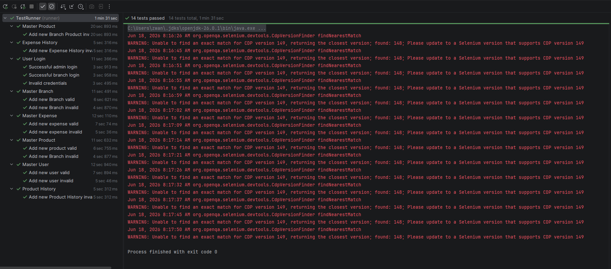

# Tokorotit Cucumber — Automated UI Testing

## Pembagian Tugas

| No | Nama | Tugas |
|----|------|-------|
| 1  | Arga | bertanggung jawab membangun fondasi awal testing serta menyusun materi presentasi   |
| 2  | Rizwan | melanjutkan pengujian untuk beberapa halaman (page) berikutnya sekaligus menyusun PPT |
| 3  | Hisyam | menyelesaikan sisa proses testing dan merampungkan materi PPT |

---

## Penjelasan Singkat SUT (System Under Test)

**Tokorotit** adalah aplikasi web manajemen toko/cabang yang berjalan di `http://127.0.0.1:8000`. Aplikasi ini memiliki dua peran pengguna utama:

| Peran | Username | Akses Dashboard | Fitur Utama |
|-------|----------|-----------------|-------------|
| **Admin** | `admin` | `/admin` | Mengelola master data (User, Product, Expense, Branch) |
| **Branch (Cabang)** | `employee` | `/branch` | Mengelola produk cabang, riwayat produk, dan riwayat pengeluaran |

### Halaman-halaman yang Diuji

| Modul | URL | Deskripsi |
|-------|-----|-----------|
| Login | `/login` | Halaman autentikasi pengguna |
| Admin Dashboard | `/admin` | Dashboard utama admin |
| Master User | `/admin/users` | CRUD data pengguna |
| Master Product | `/admin/products` | CRUD data produk |
| Master Expense | `/admin/expenses` | CRUD data pengeluaran |
| Master Branch | `/admin/branches` | CRUD data cabang |
| Branch Dashboard | `/branch` | Dashboard utama cabang |
| Branch Products | `/branch/products` | Pengelolaan produk cabang |
| Product History | `/branch/history/products` | Riwayat perubahan produk |
| Expense History | `/branch/history/expenses` | Riwayat pengeluaran cabang |

---

## Penjelasan Singkat Test Suite

Proyek ini merupakan **automated UI test** menggunakan framework **Cucumber BDD** (Behavior-Driven Development) dengan **Selenium WebDriver** (browser Microsoft Edge) dan **JUnit 5**.

### Tech Stack

| Komponen | Teknologi | Versi |
|----------|-----------|-------|
| Bahasa | Java | 21 |
| Build Tool | Maven | — |
| BDD Framework | Cucumber | 7.20.1 |
| Test Runner | JUnit 5 (JUnit Platform Suite) | 5.11.3 |
| Browser Automation | Selenium WebDriver (EdgeDriver) | 4.44.0 |
| DI Container | Cucumber PicoContainer | — |

### Struktur Proyek

```
src/
├── test/
│   ├── java/
│   │   ├── runner/
│   │   │   └── TestRunner.java            # Cucumber test runner (JUnit Platform Suite)
│   │   └── stepDefinitions/
│   │       ├── Hooks.java                 # Setup & teardown (buka/tutup browser)
│   │       ├── RandomStringGenerator.java # Utility generate string acak
│   │       ├── LoginPage.java             # Page Object — Login
│   │       ├── AdminDashboardPage.java    # Page Object — Admin Dashboard
│   │       ├── BranchDashboardPage.java   # Page Object — Branch Dashboard
│   │       ├── AdminMasterUserPage.java   # Page Object — Master User
│   │       ├── AdminMasterProductPage.java# Page Object — Master Product
│   │       ├── AdminMasterExpensePage.java# Page Object — Master Expense
│   │       ├── AdminMasterBranchPage.java # Page Object — Master Branch
│   │       ├── BranchBranchProductPage.java   # Page Object — Branch Product
│   │       ├── BranchProductHistoryPage.java  # Page Object — Product History
│   │       ├── BranchExpenseHistoryPage.java  # Page Object — Expense History
│   │       ├── LoginSteps.java            # Step Definitions — Login
│   │       ├── MasterUserSteps.java       # Step Definitions — Master User
│   │       ├── MasterProductSteps.java    # Step Definitions — Master Product
│   │       ├── MasterExpenseSteps.java    # Step Definitions — Master Expense
│   │       ├── MasterBranchSteps.java     # Step Definitions — Master Branch
│   │       ├── BranchProductSteps.java    # Step Definitions — Branch Product
│   │       ├── ProductHistorySteps.java   # Step Definitions — Product History
│   │       └── ExpenseHistorySteps.java   # Step Definitions — Expense History
│   └── resources/
│       └── features/                      # Gherkin feature files
│           ├── login.feature
│           ├── masteruser.feature
│           ├── masterproduct.feature
│           ├── masterexpense.feature
│           ├── masterbranch.feature
│           ├── branchproduct.feature
│           ├── producthistory.feature
│           └── expensehistory.feature
```

### Daftar Test Scenario

Terdapat **8 feature file** dengan total **13 scenario**:

#### 1. Login (`login.feature`) — 3 Scenario
| # | Scenario | Deskripsi |
|---|----------|-----------|
| 1 | Successful admin login | Login dengan kredensial admin valid → redirect ke `/admin` |
| 2 | Successful branch login | Login dengan kredensial branch valid → redirect ke `/branch` |
| 3 | Invalid credentials | Login dengan password salah → tetap di halaman login, muncul alert |

#### 2. Master User (`masteruser.feature`) — 2 Scenario
| # | Scenario | Deskripsi |
|---|----------|-----------|
| 1 | Add new user valid | Mengisi form user lengkap → pesan sukses "✓ User created successfully" |
| 2 | Add new user invalid | Submit form kosong → pesan error "Please fill required fields..." |

#### 3. Master Product (`masterproduct.feature`) — 2 Scenario
| # | Scenario | Deskripsi |
|---|----------|-----------|
| 1 | Add new product valid | Mengisi nama & harga produk → pesan sukses "Product created successfully." |
| 2 | Add new product invalid | Submit form kosong → pesan error "Please enter name and price" |

#### 4. Master Expense (`masterexpense.feature`) — 2 Scenario
| # | Scenario | Deskripsi |
|---|----------|-----------|
| 1 | Add new expense valid | Mengisi nama expense → pesan sukses "Expense created successfully." |
| 2 | Add new expense invalid | Submit form kosong → pesan error "Please enter an expense name" |

#### 5. Master Branch (`masterbranch.feature`) — 2 Scenario
| # | Scenario | Deskripsi |
|---|----------|-----------|
| 1 | Add new Branch valid | Mengisi nama branch → pesan sukses "Branch created successfully." |
| 2 | Add new Branch invalid | Submit form kosong → pesan error "Please enter a branch name" |

#### 6. Branch Product (`branchproduct.feature`) — 1 Scenario
| # | Scenario | Deskripsi |
|---|----------|-----------|
| 1 | Add new Branch Product invalid | Submit form kosong → pesan error "Please select a product and enter branch price" |

#### 7. Product History (`producthistory.feature`) — 1 Scenario
| # | Scenario | Deskripsi |
|---|----------|-----------|
| 1 | Add new Product History invalid | Submit form kosong → pesan error "Please fill all required fields" |

#### 8. Expense History (`expensehistory.feature`) — 1 Scenario
| # | Scenario | Deskripsi |
|---|----------|-----------|
| 1 | Add new Expense History invalid | Submit form kosong → pesan error "Please fill all required fields" |

### Pola Desain

- **Page Object Model (POM)** — Setiap halaman web direpresentasikan oleh class Java tersendiri (misalnya `LoginPage`, `AdminMasterUserPage`) yang mengenkapsulasi elemen UI dan interaksinya.
- **Hooks** — Class `Hooks.java` menangani setup (`@Before`: inisialisasi EdgeDriver & semua page object) dan teardown (`@After`: menutup browser) untuk setiap scenario.
- **Random Data** — `RandomStringGenerator` digunakan untuk menghasilkan data unik saat membuat entitas baru (user, product, dll), menghindari konflik data duplikat.

### Cara Menjalankan

**Prasyarat:**
- Java 21+
- Maven
- Microsoft Edge browser terinstal
- Aplikasi Tokorotit berjalan di `http://127.0.0.1:8000`

**Jalankan semua test:**
```bash
mvn test
```

---

## Hasil Pengujian

Berikut adalah screenshot bukti bahwa **14 test berhasil** dijalankan:


